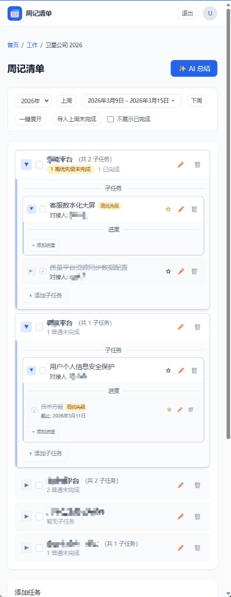

# 周记清单

> 个人周度任务管理工具，帮助职场人按周记录、分类、完成待办，并支持 AI 总结。Keep organized, stay productive.

[](LICENSE)

## ✨ 为什么选择周记清单？

市面上的待办工具要么过于简单（纯清单），要么过于复杂（完整项目管理）。周记清单专注**周度规划**场景，在轻量与专业之间取得平衡：

- **层级清晰**：大分类 → 子分类 → 主任务 → 子任务 → 进度，五级结构适配真实工作流
- **周度视角**：按周组织任务，年份选择 + 全年周列表 + 第 N 周显示，快速跳转任意周
- **高效操作**：一键展开/收起、不展示已完成、一键导入上周未完成，减少重复操作
- **数据独立**：导入上周任务后，本周修改不影响历史记录，AI 总结时自动去重
- **开箱即用**：Supabase + Vercel 部署，无需自建服务器，几分钟即可上线

## 📸 界面预览

### 周度任务页

支持主任务、子任务、进度三级管理，高优先级标识、对接人、截止日期一目了然。周选择器支持年份切换与全年周列表快速导航。



### AI 总结（预留）

选择时间范围，一键生成已完成任务的 AI 总结，快速产出周报/月报。当前为占位功能，后续将接入真实 AI 服务。


## 🚀 核心功能

| 功能 | 说明 |
|------|------|
| **多级分类** | 大分类（工作/生活/家庭）→ 子分类（2025年工作等）→ 周度任务 |
| **任务层级** | 主任务 → 子任务 → 进度，支持优先级、对接人、截止日期 |
| **一键展开/收起** | 一次性展开或收起所有主任务、子任务及进度 |
| **不展示已完成** | 勾选后隐藏已完成项，专注待办 |
| **一键导入上周未完成** | 将上周未完成的主任务、子任务、进度复制到本周并合并，数据独立 |
| **周选择器** | 年份选择、全年周列表、第 N 周显示，快速跳转 |
| **本周已完成汇总** | 自动汇总本周完成项，支持单条/全部复制 |
| **AI 总结** | 选择时间范围生成总结（预留，即将接入） |

## 🛠 技术栈

- **前端**：Next.js 16、React 19、Tailwind CSS、SWR
- **后端**：Next.js API Routes
- **数据库**：Supabase (PostgreSQL)
- **部署**：Vercel
- **PWA**：Serwist

## 📦 快速开始

### 环境要求

- Node.js 18+
- pnpm（推荐）

### 本地开发

```bash
# 克隆项目
git clone <repo-url>
cd weekly-plan

# 安装依赖
pnpm install

# 配置环境变量
cp .env.example .env.local
# 编辑 .env.local 填入 AUTH_USERNAME（默认 admin）、AUTH_PASSWORD、Supabase 凭证

# 启动开发服务器
pnpm dev
```

### 部署到 Vercel + Supabase

详见 [部署指南](docs/DEPLOY-VERCEL-SUPABASE.md)。

1. 在 Supabase 创建项目，执行 `supabase/migrations/001_initial.sql`
2. 在 Vercel 导入项目，配置环境变量
3. 部署

## 📁 项目结构

```
src/
├── app/                    # Next.js App Router
│   ├── page.tsx            # 首页（分类列表）
│   ├── loading.tsx         # 骨架屏
│   ├── login/              # 登录页
│   ├── [categoryId]/       # 大分类、子分类、任务
│   └── api/                # API 路由
├── components/             # 公共组件
├── lib/
│   ├── supabase.ts         # Supabase 客户端
│   ├── auth.ts             # 认证
│   └── services/           # 业务逻辑
├── middleware.ts           # 鉴权
└── styles/
```

## 📚 文档

- [部署指南](docs/DEPLOY-VERCEL-SUPABASE.md)
- [技术设计](docs/TechDesign-周记清单-MVP.md)
- [UI 规格](docs/UI-Spec-周记清单-Stitch.md)
- [一键导入设计](docs/DESIGN-import-weekly-incomplete.md)

## 📄 许可证

ISC
